#UbuntuをVPNサーバ、WindowsをVPNクライアントでOpenVPNしてみる

## 概要
VPN を構成する方式は、大きく二つ。
### ルーティング方式(tunデバイスを利用)
- 構成図

   
  - 出典：[OpenVPNで構築する超簡単VPN入門](http://www.amazon.co.jp/OpenVPN%E3%81%A7%E6%A7%8B%E7%AF%89%E3%81%99%E3%82%8B%E8%B6%85%E7%B0%A1%E5%8D%98VPN%E5%85%A5%E9%96%80%E2%80%95Windows-Mac-OS-X-Linux%E5%AF%BE%E5%BF%9C/dp/4899771673)
- 特長
  - 1(クライアント)対1(サーバ)でよければ設定は簡単。
  - 1対多(サーバ+同一ネットワーク内端末)だと、ちょっと大変。上図だと、ホストAとホストBは直接接続できない。サーバでルーティング設定が必要。
  - クライアントには、サーバ側ネットワークのローカルIP(例:192.168.11.x)と別ドメインのIP(10.0.8.x)が振られる。
  - ネットワーク層トンネリングをするので、TCP/IPしか使えない。

### ブリッジ方式(tapデバイスを利用)
- 構成図

  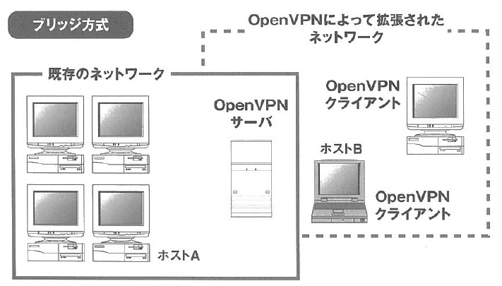 
  - 出典：[OpenVPNで構築する超簡単VPN入門](http://www.amazon.co.jp/OpenVPN%E3%81%A7%E6%A7%8B%E7%AF%89%E3%81%99%E3%82%8B%E8%B6%85%E7%B0%A1%E5%8D%98VPN%E5%85%A5%E9%96%80%E2%80%95Windows-Mac-OS-X-Linux%E5%AF%BE%E5%BF%9C/dp/4899771673)
- 特長
  - 1対多に対応している。ホストAとホストBが直接接続できる。
  - サーバ側でブリッジ接続の設定が必須。こいつがょっと面倒
  - クライアントには、サーバ側ネットワークのローカルIP(例:192.168.11.x)と同一ドメインのIPが振られる。
  - データリンク層でトンネリングするので、NetBEUIも使えるらしい。

### 参考リンク
  - [Gentoo Linuxな生活​/OpenVPNで悩む](http://femt.ddo.jp/modules/xpwiki/?Gentoo%20Linux%E3%81%AA%E7%94%9F%E6%B4%BB%2FOpenVPN%E3%81%A7%E6%82%A9%E3%82%80)

## 共通手順
1. サーバ設定
  1. rootでログイン
  1. OpenVPNをUbuntuにインストールする
  1. サーバ証明書を発行する
  1. OpeVPNを設定する
    - tunとtapで違いがある部分
  1. ファイアウォールを設定する
  1. ルータを設定する
  1. クライアント証明書を発行する
1. クライアント設定
  1. クライアントアプリをインストールする
  1. クライアントアプリを設定する
    - tunとtapで違いがある部分
  1. ファイアウォールを設定する
  1. 接続する
  1. 接続を確認する

### 認証局について
- まっとうな認証局しかVPNサーバとVPNクライアントに証明書と鍵を配布できない、とルールで運用することで、VPNのセキュリティが保証されている。
- こいつが悪いやつだと世界が終わる。
- この認証局は普通はサーバと別なのだが、簡易認証局である`easy-rsa`という仕組みを使ってサーバ上で全部作ってしまおう、という流れ。
- 分かりやすい図
  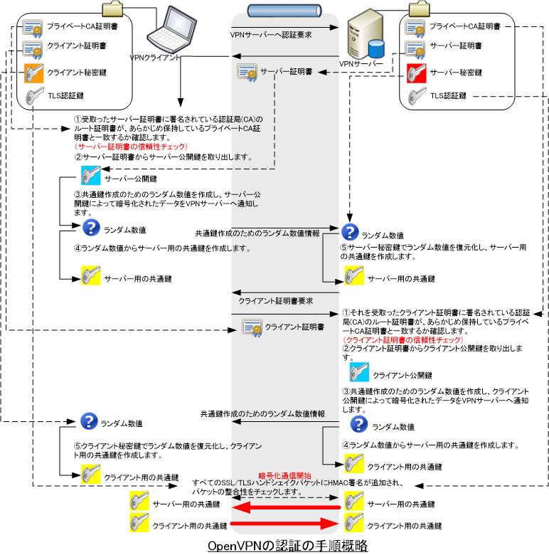
  - 出典: [SSL 認証 の仕組みと OpenVPN の認証の仕組み](http://server-setting.info/blog/ssl-openvpn-authentication.html)

### ルータを設定する理由
- デフォルトだと全ポートが接続不可となっているので、開放する必要がある。
- かつ、ポートフォワードをしないと、ドメイン内のどれがVPNサーバか判断できないので。
  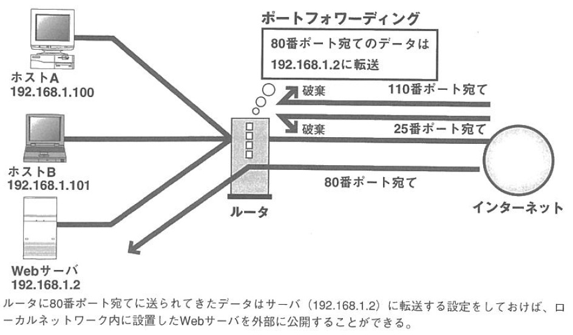
  - 出典：[OpenVPNで構築する超簡単VPN入門](http://www.amazon.co.jp/OpenVPN%E3%81%A7%E6%A7%8B%E7%AF%89%E3%81%99%E3%82%8B%E8%B6%85%E7%B0%A1%E5%8D%98VPN%E5%85%A5%E9%96%80%E2%80%95Windows-Mac-OS-X-Linux%E5%AF%BE%E5%BF%9C/dp/4899771673)

## 構成1: ルーティング方式(tun)
### 実現したい構成
- 構成図


### 手順

#### 基本的に従った情報
- [Ubuntu 14.04 で OpenVPN ](http://felis-silvestris-catus.hatenablog.com/entry/2015/05/27/222434)
- OpenVPNの設定
  - [その1：認証用ファイルの生成](https://fuketch.wordpress.com/2013/02/19/openvpn%E3%81%AE%E8%A8%AD%E5%AE%9A%EF%BC%88%E3%81%9D%E3%81%AE1%EF%BC%9A%E8%AA%8D%E8%A8%BC%E7%94%A8%E3%83%95%E3%82%A1%E3%82%A4%E3%83%AB%E3%81%AE%E7%94%9F%E6%88%90%EF%BC%89/)
  - [その4：トンネルモードサーバー設定](https://fuketch.wordpress.com/2013/09/10/openvpn%E3%81%AE%E8%A8%AD%E5%AE%9A%EF%BC%88%E3%81%9D%E3%81%AE4%EF%BC%9A%E3%83%88%E3%83%B3%E3%83%8D%E3%83%AB%E3%83%A2%E3%83%BC%E3%83%89%E3%82%B5%E3%83%BC%E3%83%90%E3%83%BC%E8%A8%AD%E5%AE%9A%EF%BC%89/)
  - [その5：トンネルモードクライアント設定](https://fuketch.wordpress.com/2013/09/10/openvpn%E3%81%AE%E8%A8%AD%E5%AE%9A%EF%BC%88%E3%81%9D%E3%81%AE5%EF%BC%9A%E3%83%88%E3%83%B3%E3%83%8D%E3%83%AB%E3%83%A2%E3%83%BC%E3%83%89%E3%82%AF%E3%83%A9%E3%82%A4%E3%82%A2%E3%83%B3%E3%83%88%E8%A8%AD/)
- [OpenVPNで構築する超簡単VPN入門](http://www.amazon.co.jp/OpenVPN%E3%81%A7%E6%A7%8B%E7%AF%89%E3%81%99%E3%82%8B%E8%B6%85%E7%B0%A1%E5%8D%98VPN%E5%85%A5%E9%96%80%E2%80%95Windows-Mac-OS-X-Linux%E5%AF%BE%E5%BF%9C/dp/4899771673)

#### つまづいた箇所の補足メモ
1. サーバ設定
  1. rootでログイン
    - `su -i` で入った後迷子になる。一回`cd /`でてっぺんに行くといい。
  1. OpeVPNを設定する
    - `server.conf` の実績ファイルは[これ](https://github.com/mum254/Memos/blob/master/OpenVPN/easy-rsa_back_TUN_151013_success/server.conf) 。TLSとかcipherの入力を省いて簡単構成にしている。
    - ファイアウォール設定ツールで次のような画面が表示される
      - `ルール`でUDPを開放している様子が表示されており、`リスニングレポート`でopenvpnが起動中であることを示す。
    - 起動、停止、状態確認は `service openvpn start/stop/status` でやるといい。
      - `service openvpn status`で起動状態をチェックできる。
      - 非同期なのでshellを余計に潰さない。
    - `/etc/openvpn/openvpn.log`で以下のように出力されればよい。
    ```
      Tue Oct 13 22:13:13 2015 OpenVPN 2.3.2 x86_64-pc-linux-gnu [SSL (OpenSSL)] [LZO] [EPOLL] [PKCS11] [eurephia] [MH] [IPv6] built on Dec  1 2014
      Tue Oct 13 22:13:13 2015 Diffie-Hellman initialized with 1024 bit key
      Tue Oct 13 22:13:13 2015 Socket Buffers: R=[212992->131072] S=[212992->131072]
      Tue Oct 13 22:13:13 2015 ROUTE_GATEWAY 192.168.179.1/255.255.255.0 IFACE=eth2 HWADDR=a4:12:42:3b:fa:99
      Tue Oct 13 22:13:13 2015 TUN/TAP device tun0 opened
      Tue Oct 13 22:13:13 2015 TUN/TAP TX queue length set to 100
      Tue Oct 13 22:13:13 2015 do_ifconfig, tt->ipv6=0, tt->did_ifconfig_ipv6_setup=0
      Tue Oct 13 22:13:13 2015 /sbin/ip link set dev tun0 up mtu 1500
      Tue Oct 13 22:13:13 2015 /sbin/ip addr add dev tun0 local 10.8.0.1 peer 10.8.0.2
      Tue Oct 13 22:13:13 2015 /sbin/ip route add 10.8.0.0/24 via 10.8.0.2
      Tue Oct 13 22:13:13 2015 GID set to nogroup
      Tue Oct 13 22:13:13 2015 UID set to nobody
      Tue Oct 13 22:13:13 2015 UDPv4 link local (bound): [undef]
      Tue Oct 13 22:13:13 2015 UDPv4 link remote: [undef]
      Tue Oct 13 22:13:13 2015 MULTI: multi_init called, r=256 v=256
      Tue Oct 13 22:13:13 2015 IFCONFIG POOL: base=10.8.0.4 size=62, ipv6=0
      Tue Oct 13 22:13:13 2015 IFCONFIG POOL LIST
      Tue Oct 13 22:13:13 2015 Initialization Sequence Completed
      Tue Oct 13 22:14:42 2015 210.150.14.177:60147 TLS: Initial Sequence Completed
    ```
  1. サーバ証明書を発行する
    - `easy-rsa` のファイルは以下の様に取得、展開するといい。
    ```
      # wget http://build.openvpn.net/downloads/releases/easy-rsa-2.2.0_master.tar.gz
      # tar zxvf ./easy-rsa-2.2.0_master.tar.gz

      解凍したeasy-rsaの証明書／鍵作成用ディレクトリをopenvpnのディレクトリ配下へコピー
      # cp -r ./easy-rsa-2.2.0_master/easy-rsa/2.0/ /etc/openvpn/easy-rsa
      
      各処理スクリプトに実行権を付与。
      # cd /etc/openvpn/easy-rsa/
      # chmod +x *
    ```
    - `./build-dh` はちと時間食う。
    - `openvpn --genkey --secret`は` openvpn --genkey --secret ta.key` が正しい。
    - `cp ca.crt server.crt server.keydh1024.pem ta.key /etc/openvpn`は`cp ca.crt server.crt server.key dh2048.pem ta.key /etc/openvpn/` が正しい。
  1. OpeVPNを設定する
    - DHパラメータの指定
      - `dh dh2048.pem` は、サーバ証明書を発行した時同一のものを選択すること。
    - 通信暗号化の設定
      - `cipher AES-256-CBC`はクライアント側の設定でも使うので、必ずこれに合わせること。
    - その他のオプション 
      - クライアントがiPhoneの場合は`;comp-lzo`を無効にするらしい。PCなら有効にした方が通信は容量が下がるはず。
  1. ファイアウォールを設定する
    - ファイアウォール設定ツール [gufw](http://sicklylife.at-ninja.jp/memo/ubuntu1404/gufw.html) をインストール
    - UDPでポート1194をオープンすること。下記のような画面になるはず。
      - `sudo apt-get install gufw`
        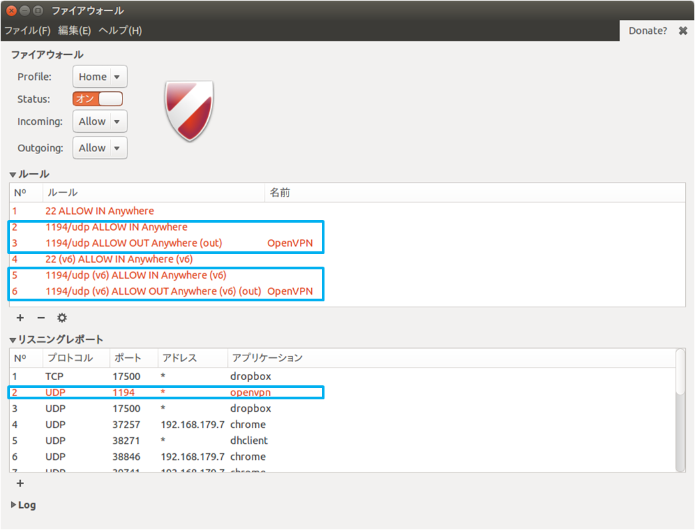
  1. ルータを設定する
    - ルータのグローバルIPにポート1194でアクセス要求があった場合に、どのPCにフォワードするかを設定する。
    - 自分の環境で使用しているルータにアクセスして、ポートフォワードの設定すること。
      - [NEC Aterm MR03LN の場合](http://www.akakagemaru.info/port/mr03ln-portfw.html)
      - [Buffalo WHR-300HP2 の場合](http://www.akakagemaru.info/port/meruko/whr-300hp2-portfw.html)
    - Aterm MR03LN で設定した後の画面
      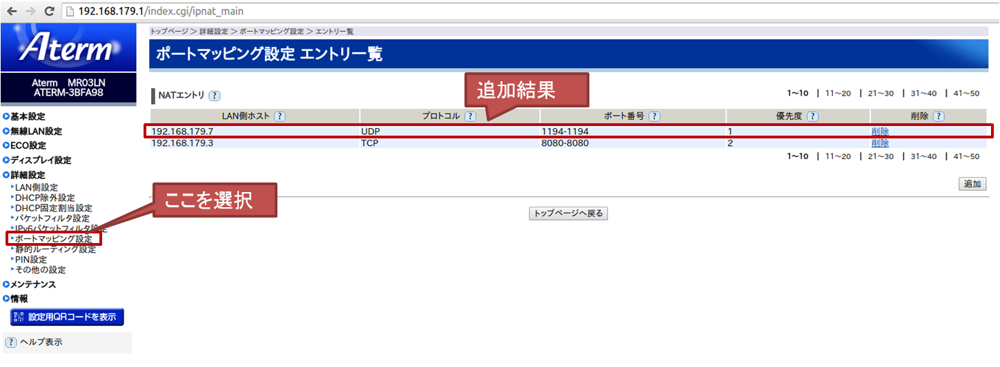 
  1. クライアント証明書を発行する
    - `# ./pkitool client1`で`failed to update database TXT_DB error number 2` というエラーが出る
      - `KEY_CN=someuniqueclientcn ./pkitool client` で上記エラーを回避。
      - 回避策としてコモンネームを変更しないと鍵作成ができないため。
      - 参考：http://aclock.org/?p=101
    - 上記コマンドで、`Error Loading extension section usr_cert` というエラーが出る
      - `/etc/openvpn/easy-rsa`で `perl -p -i -e 's|^(subjectAltName=)|#$1|;' /etc/openvpn/easy-rsa/openssl-1.0.0.cnf` をすると解決。
        - Ubuntu 14.04のバグで、`openssl-1.0.0.cnf`がおかしいらしいので、上記コメンド修復する。
        - 参考：http://stackoverflow.com/questions/24255205/error-loading-extension-section-usr-cert
    - 接続確認
      - まずは同一ネットワーク内で接続確認する。
      - そこでうまく行くことを確認した後、グローバルIPで`ping`確認。
      - グローバルIPアドレスは[ここから取得](http://www.cman.jp/network/support/go_access.cgi)
      - Aterm MR03LN の管理ページからもグローバルIPを確認可能
        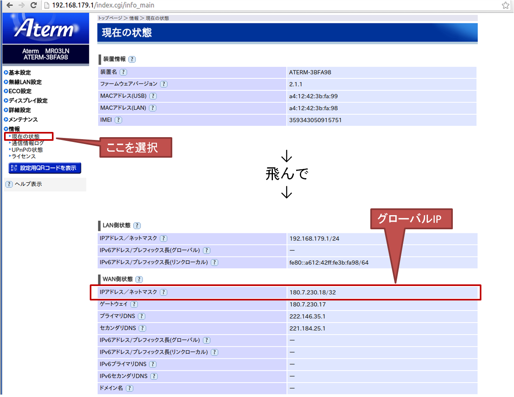 
      - Aterm MR03LN のグローバルIPから`ping`応答がないとき、管理ページから有効にする。
        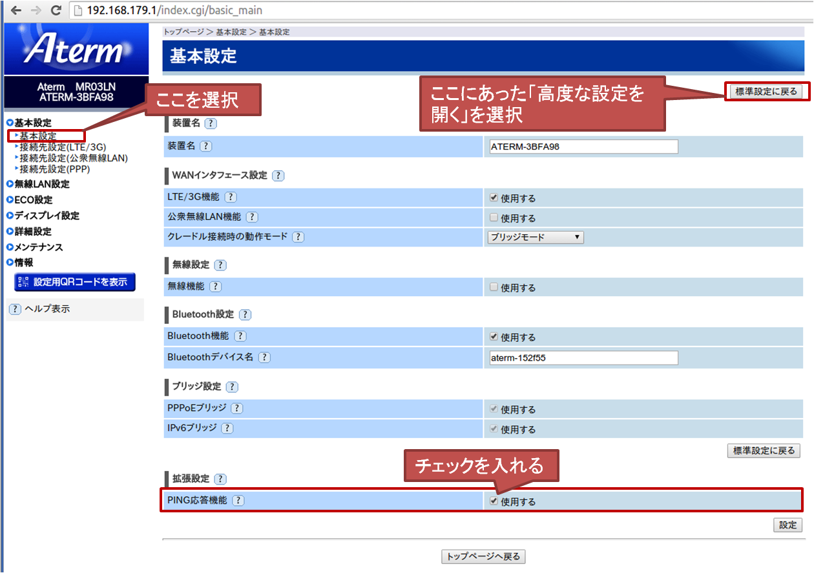 
1. クライアント設定
  1. クライアントアプリをインストールする
    - `OpenVPN for Windows`か`vpnux`が便利。
  1. クライアントアプリを設定する
    1. OpenVPN
      1. `client.conf` を設定する。実績ファイルは[これ](https://github.com/mum254/Memos/blob/master/OpenVPN/easy-rsa_back_TUN_151013_success/client_tun.ovpn)。
    1. vpnux
      - [このサイト](http://www.cman.jp/network/support/go_access.cgi)でサーバ側のグローバルIPを確認する。
        - そしてクライアントアプリにこんな風に入力する。
        
      - もしうまく行かない時、原因切り分けのため最初に同一LAN内で確認したほうがいい。
        - こんな構成を想定。
        
        - この場合はこんな風に入力。
        
  1. ファイアウォールを設定する
    - UDPでポート1194を開放する。OSにあった設定をすること。
  1. 接続する
    - クライアント側で`TLS Error: TLS key negotiation failed to occur within 60 seconds (check your network connectivity)`が出る
      - ここを見ながら原因追求する
        - https://www.gsais.kyoto-u.ac.jp/staff/liang/oss/ovpn2_howto_ja.html#start
      - ポートが開放されているか確認する
        - TCPポート確認ツールは[webからhttpでアクセスして確認](http://www.cman.jp/network/support/port.html)できる。
        - [ここ](http://www.akakagemaru.info/port/faq-disableport.html)を見ながら色々なTCPポートを開放して確認してみることができる。
          - ブラウザで`サーバIP:ポート番号`と入力。例: `192.168.1.3:8080`等。
          - Windowsアプリの`ANHTTPD`超便利。
        - UDPポート確認ツールはWireSharkらしい。使う前につながったから未検証。
    - クライアント側で`TCP/UDP: Incoming packet rejected from xxx.xxx.xxx.xxx:1194, expected peer address: xxx.xxx.xxx.xxx:1194 (allow this incoming source address/port by removing --remote or adding --float)  ...` が出る
      - 同じネットワークいるのが原因。サーバとクライアントを別ネットワークにしてから接続すればつながるはず。
    - クライアント側で`VERIFY ERROR` が出る
      - 認証鍵の作成ミスの可能性あり。鍵を作成し直す。
      - 参考：http://nlogn.ath.cx/archives/001023.html
    - 成功した時のメッセージ(クライアント)
      - 初期処理 
      ```
      2015/10/12 0:36:08 OpenVPN 2.3.7 x86_64-w64-mingw32 [SSL (OpenSSL)] [LZO] [PKCS11] [IPv6] built on Jul  9 2015
      2015/10/12 0:36:08 library versions: OpenSSL 1.0.1p 9 Jul 2015, LZO 2.08
      2015/10/12 0:36:08 MANAGEMENT: TCP Socket listening on [AF_INET]127.0.0.1:31198
      2015/10/12 0:36:08 WARNING: No server certificate verification method has been enabled.  See http://openvpn.net/howto.html#mitm for more info.
      2015/10/12 0:36:08 Control Channel Authentication: tls-auth using INLINE static key file
      2015/10/12 0:36:08 Outgoing Control Channel Authentication: Using 160 bit message hash 'SHA1' for HMAC authentication
      2015/10/12 0:36:08 Incoming Control Channel Authentication: Using 160 bit message hash 'SHA1' for HMAC authentication
      2015/10/12 0:36:08 Socket Buffers: R=[8192->65536] S=[8192->65536]
      2015/10/12 0:36:08 UDPv4 link local (bound): [undef]
      2015/10/12 0:36:08 UDPv4 link remote: [AF_INET]153.250.223.182:1194
      ```
      - ルートフォワードが出来ていれば次のように進む。まずはTLSの認証。
      ```
      2015/10/12 0:36:08 TLS: Initial packet from [AF_INET]153.250.223.182:1194, sid=d73cf2d3 c1ac69ee
      ```
      - 証明書作成時(`/etc/openvpn/easy-rsa/vars`)の設定を確認している。
      ```
      2015/10/12 0:36:17 VERIFY OK: depth=1, C=JP, ST=Tokyo, L=Fukuoka, O=CIR^-KIT, OU=Develop, CN=CIR^-KIT CA, name=EasyRSA, emailAddress=p595201@mail.kyutech.jp
      2015/10/12 0:36:17 VERIFY OK: depth=0, C=JP, ST=Tokyo, L=Fukuoka, O=CIR^-KIT, OU=Develop, CN=server, name=EasyRSA, emailAddress=p595201@mail.kyutech.jp
      ```
      - 暗号化アルゴリズムの指定を確認している(`server.conf`, `client.conf`)。
      ```
      2015/10/12 0:36:18 Data Channel Encrypt: Cipher 'AES-128-CBC' initialized with 128 bit key
      2015/10/12 0:36:18 Data Channel Encrypt: Using 160 bit message hash 'SHA1' for HMAC authentication
      2015/10/12 0:36:18 Data Channel Decrypt: Cipher 'AES-128-CBC' initialized with 128 bit key
      2015/10/12 0:36:18 Data Channel Decrypt: Using 160 bit message hash 'SHA1' for HMAC authentication
      2015/10/12 0:36:18 Control Channel: TLSv1, cipher TLSv1/SSLv3 DHE-RSA-AES256-SHA, 2048 bit RSA
      2015/10/12 0:36:18 [server] Peer Connection Initiated with [AF_INET]153.250.223.182:1194
      2015/10/12 0:36:21 SENT CONTROL [server]: 'PUSH_REQUEST' (status=1)
      ```
      - 何かTLS認証に失敗しているけど、先には進めるらしい。
      ```
      2015/10/12 0:36:21 Authenticate/Decrypt packet error: bad packet ID (may be a replay): [ #81 / time = (1444577767) Mon Oct 12 00:36:07 2015 ] -- see the man page entry for --no-replay and --replay-window for more info or silence this warning with --mute-replay-warnings
      2015/10/12 0:36:21 TLS Error: incoming packet authentication failed from [AF_INET]153.250.223.182:1194
      2015/10/12 0:36:21 PUSH: Received control message: 'PUSH_REPLY,route 192.168.11.0 255.255.255.0,redirect-gateway def1 bypass-dhcp,dhcp-option DNS 192.168.11.1,route 10.8.0.0 255.255.255.0,topology net30,ping 10,ping-restart 120,ifconfig 10.8.0.6 10.8.0.5'
      ```
      - 引き続き`.conf`設定にしたがって色々やっている。
      ```
      2015/10/12 0:36:21 OPTIONS IMPORT: timers and/or timeouts modified
      2015/10/12 0:36:21 OPTIONS IMPORT: --ifconfig/up options modified
      2015/10/12 0:36:21 OPTIONS IMPORT: route options modified
      2015/10/12 0:36:21 OPTIONS IMPORT: --ip-win32 and/or --dhcp-option options modified
      2015/10/12 0:36:21 do_ifconfig, tt->ipv6=0, tt->did_ifconfig_ipv6_setup=0
      ```
      - クライアント側でtap接続が確率される。
      ```
      2015/10/12 0:36:21 open_tun, tt->ipv6=0
      2015/10/12 0:36:21 TAP-WIN32 device [ローカル エリア接綁E3] opened: \\.\Global\{A8A9F787-9860-4180-B420-A04BA71B1358}.tap
      2015/10/12 0:36:21 TAP-Windows Driver Version 9.9
      2015/10/12 0:36:21 Notified TAP-Windows driver to set a DHCP IP/netmask of 10.8.0.6/255.255.255.252 on interface {A8A9F787-9860-4180-B420-A04BA71B1358} [DHCP-serv: 10.8.0.5, lease-time: 31536000]
      2015/10/12 0:36:21 Successful ARP Flush on interface [38] {A8A9F787-9860-4180-B420-A04BA71B1358}
      2015/10/12 0:36:26 TEST ROUTES: 3/3 succeeded len=2 ret=1 a=0 u/d=up
      ```
      - サーバ側ゲートウェイのglobal IP -> クライアント側ゲートウェイのlocal IP
      ```
      2015/10/12 0:36:26 C:\Windows\system32\route.exe ADD 153.250.223.182 MASK 255.255.255.255 192.168.11.1
      2015/10/12 0:36:26 ROUTE: CreateIpForwardEntry succeeded with dwForwardMetric1=25 and dwForwardType=4
      2015/10/12 0:36:26 Route addition via IPAPI succeeded [adaptive]
      ```
      - クライアント側ゲートウェイのlocal IP -> クライアント側ゲートウェイのlocal IP
      ```
      2015/10/12 0:36:26 C:\Windows\system32\route.exe ADD 192.168.11.1 MASK 255.255.255.255 192.168.11.1 IF 13
      2015/10/12 0:36:26 ROUTE: CreateIpForwardEntry succeeded with dwForwardMetric1=25 and dwForwardType=4
      2015/10/12 0:36:26 Route addition via IPAPI succeeded [adaptive]
      ```
      - ? -> クライアント側PCのtunのlocal IP
      ```
      2015/10/12 0:36:26 C:\Windows\system32\route.exe ADD 0.0.0.0 MASK 128.0.0.0 10.8.0.5
      2015/10/12 0:36:26 ROUTE: CreateIpForwardEntry succeeded with dwForwardMetric1=30 and dwForwardType=4
      2015/10/12 0:36:26 Route addition via IPAPI succeeded [adaptive]
      2015/10/12 0:36:26 C:\Windows\system32\route.exe ADD 128.0.0.0 MASK 128.0.0.0 10.8.0.5
      2015/10/12 0:36:26 ROUTE: CreateIpForwardEntry succeeded with dwForwardMetric1=30 and dwForwardType=4
      2015/10/12 0:36:26 Route addition via IPAPI succeeded [adaptive]
      ```
      - クライアント側ネットワークの? -> クライアント側PCのtunのlocal IP
      ```
      2015/10/12 0:36:26 C:\Windows\system32\route.exe ADD 192.168.11.0 MASK 255.255.255.0 10.8.0.5
      2015/10/12 0:36:26 ROUTE: CreateIpForwardEntry succeeded with dwForwardMetric1=30 and dwForwardType=4
      2015/10/12 0:36:26 Route addition via IPAPI succeeded [adaptive]
      ```
      - クライアント側のtun ネットワークの? -> クライアント側PCのtunのlocal IP
      ```
      2015/10/12 0:36:26 C:\Windows\system32\route.exe ADD 10.8.0.0 MASK 255.255.255.0 10.8.0.5
      2015/10/12 0:36:26 ROUTE: CreateIpForwardEntry succeeded with dwForwardMetric1=30 and dwForwardType=4
      2015/10/12 0:36:26 Route addition via IPAPI succeeded [adaptive]
      ```
      - 成功時のメッセージ
      ```
      2015/10/12 0:36:26 Initialization Sequence Completed
      ```
    - 成功した時のメッセージ(サーバ)
    ```
    Tue Oct 13 22:35:36 2015 210.150.14.177:58485 TLS: Initial packet from [AF_INET]210.150.14.177:58485, sid=06afde28 b97860ca
    Tue Oct 13 22:35:38 2015 210.150.14.177:58485 VERIFY OK: depth=1, C=JP, ST=Fukuoka, L=Kitakyushu, O=CIR-KIT, OU=Students, CN=CIR-KIT CA, name=EasyRSA, emailAddress=p595201m@mail.kyutech.jp
    Tue Oct 13 22:35:38 2015 210.150.14.177:58485 VERIFY OK: depth=0, C=JP, ST=Fukuoka, L=Kitakyushu, O=CIR-KIT, OU=Students, CN=client1, name=EasyRSA, emailAddress=p595201m@mail.kyutech.jp
    Tue Oct 13 22:35:43 2015 210.150.14.177:58485 Data Channel Encrypt: Cipher 'BF-CBC' initialized with 128 bit key
    Tue Oct 13 22:35:43 2015 210.150.14.177:58485 Data Channel Encrypt: Using 160 bit message hash 'SHA1' for HMAC authentication
    Tue Oct 13 22:35:43 2015 210.150.14.177:58485 Data Channel Decrypt: Cipher 'BF-CBC' initialized with 128 bit key
    Tue Oct 13 22:35:43 2015 210.150.14.177:58485 Data Channel Decrypt: Using 160 bit message hash 'SHA1' for HMAC authentication
    Tue Oct 13 22:35:43 2015 210.150.14.177:58485 Control Channel: TLSv1, cipher TLSv1/SSLv3 DHE-RSA-AES256-SHA, 1024 bit RSA
    Tue Oct 13 22:35:43 2015 210.150.14.177:58485 [client1] Peer Connection Initiated with [AF_INET]210.150.14.177:58485
    Tue Oct 13 22:35:43 2015 client1/210.150.14.177:58485 MULTI_sva: pool returned IPv4=10.8.0.6, IPv6=(Not enabled)
    Tue Oct 13 22:35:43 2015 client1/210.150.14.177:58485 MULTI: Learn: 10.8.0.6 -> client1/210.150.14.177:58485
    Tue Oct 13 22:35:43 2015 client1/210.150.14.177:58485 MULTI: primary virtual IP for client1/210.150.14.177:58485: 10.8.0.6
    Tue Oct 13 22:35:45 2015 client1/210.150.14.177:58485 PUSH: Received control message: 'PUSH_REQUEST'
    Tue Oct 13 22:35:45 2015 client1/210.150.14.177:58485 send_push_reply(): safe_cap=940
    Tue Oct 13 22:35:45 2015 client1/210.150.14.177:58485 SENT CONTROL [client1]: 'PUSH_REPLY,route 192.168.179.0 255.255.255.0,redirect-gateway def1 bypass-dhcp,dhcp-option DNS 192.168.179.1,route 10.8.0.1,topology net30,ping 10,ping-restart 120,ifconfig 10.8.0.6 10.8.0.5' (status=1)
    ```
      
  1. 接続を確認する
    1. サーバ側
      - `ifconfig` で次のような構成をとっている。
        ```
        eth2      Link encap:イーサネット  ハードウェアアドレス a4:12:42:3b:fa:99  
          inetアドレス:192.168.179.7  ブロードキャスト:192.168.179.255  マスク:255.255.255.0
          inet6アドレス: fe80::a612:42ff:fe3b:fa99/64 範囲:リンク
          UP BROADCAST RUNNING PROMISC MULTICAST  MTU:1500  メトリック:1
          RXパケット:14604 エラー:0 損失:0 オーバラン:0 フレーム:0
          TXパケット:14122 エラー:0 損失:0 オーバラン:0 キャリア:0
          衝突(Collisions):0 TXキュー長:1000 
          RXバイト:4941716 (4.9 MB)  TXバイト:4016691 (4.0 MB)

        lo        Link encap:ローカルループバック  
          inetアドレス:127.0.0.1  マスク:255.0.0.0
          inet6アドレス: ::1/128 範囲:ホスト
          UP LOOPBACK RUNNING  MTU:65536  メトリック:1
          RXパケット:5918187 エラー:0 損失:0 オーバラン:0 フレーム:0
          TXパケット:5918187 エラー:0 損失:0 オーバラン:0 キャリア:0
          衝突(Collisions):0 TXキュー長:0 
          RXバイト:4806771628 (4.8 GB)  TXバイト:4806771628 (4.8 GB)

        tun0      Link encap:不明なネット  ハードウェアアドレス 00-00-00-00-00-00-00-00-00-00-00-00-00-00-00-00  
          inetアドレス:10.8.0.1  P-t-P:10.8.0.2  マスク:255.255.255.255
          UP POINTOPOINT RUNNING NOARP MULTICAST  MTU:1500  メトリック:1
          RXパケット:0 エラー:0 損失:0 オーバラン:0 フレーム:0
          TXパケット:1 エラー:0 損失:0 オーバラン:0 キャリア:0
          衝突(Collisions):0 TXキュー長:100 
          RXバイト:0 (0.0 B)  TXバイト:84 (84.0 B)

        wlan0     Link encap:イーサネット  ハードウェアアドレス 5c:c5:d4:1c:f5:70  
          inet6アドレス: fe80::5ec5:d4ff:fe1c:f570/64 範囲:リンク
          UP BROADCAST PROMISC MULTICAST  MTU:1500  メトリック:1
          RXパケット:7639696 エラー:0 損失:0 オーバラン:0 フレーム:0
          TXパケット:8188470 エラー:0 損失:0 オーバラン:0 キャリア:0
          衝突(Collisions):0 TXキュー長:1000 
          RXバイト:5784367971 (5.7 GB)  TXバイト:8292467773 (8.2 GB)

        ```
    1. クライアント側(Windows7)
      - `ipconfig` で次のような構成を取る
        - `10.8.0.6` が出てくるはず。
        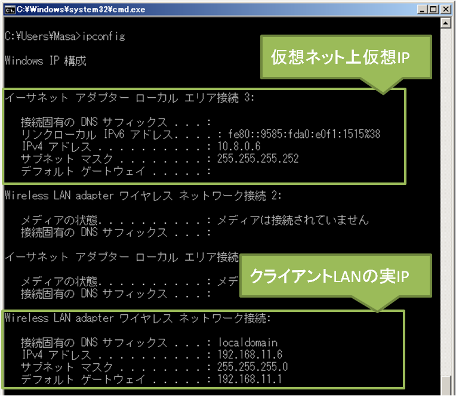
      - ネットワークの設定で次のような構成を取る
        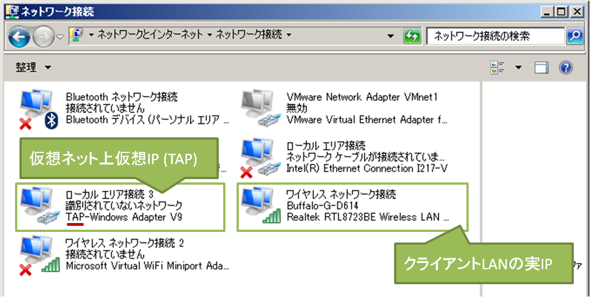
      - `ping 10.8.0.1`、`ping 192.168.179.6` が通る。感動！
        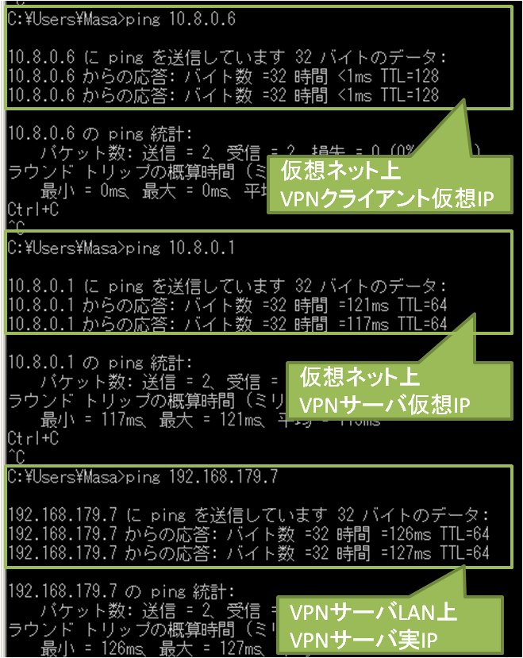
        - これを`ROS_MASTER_URI`に登録すればよさげ。
      - `route print` で次のような表示となる。
        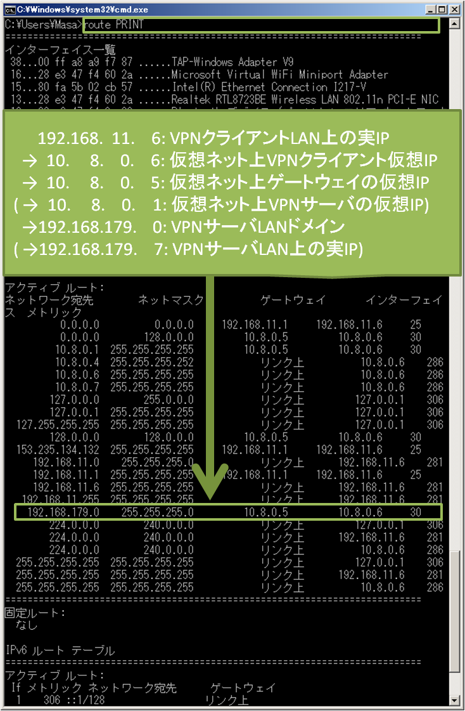
      
#### 個人メモ
- 我が家でのルータ設定
  - http://192.168.11.1/
    - id(デフォ): admin
    - pass(デフォ): password
  - ゲーム&アプリから登録。UDPポート1194を許可する。
  - やりかた
    - http://www.akakagemaru.info/port/meruko/whr-300hp2-portfw.html
  - できないとき
    - http://www.akakagemaru.info/port/faq-disableport.html
  - 二重ルータの場合
    - traceroute でルータが二重になっていたら、二段階でポート開放しないといけない。 
    - http://www.akakagemaru.info/port/metarugia-ybbhikari.html
- 積んだ
  - ネットワークは、1. アパート ー 2.うちのバッファロー ー 3. PC
  - 2 は開放できるが、1 は任意に開放できない！1はアパート側のルータで、ただで使わせてもらっている…。
      
- ATERM (モバイルWifiルータ)
  - こっちでやるとつながったよ。

## 構成1: ブリッジ方式(tap)
### 手順

#### 基本的に従った情報
- [OpenVPNで構築する超簡単VPN入門](http://www.amazon.co.jp/OpenVPN%E3%81%A7%E6%A7%8B%E7%AF%89%E3%81%99%E3%82%8B%E8%B6%85%E7%B0%A1%E5%8D%98VPN%E5%85%A5%E9%96%80%E2%80%95Windows-Mac-OS-X-Linux%E5%AF%BE%E5%BF%9C/dp/4899771673)
- OpenVPNの設定
  - [その1：認証用ファイルの生成](https://fuketch.wordpress.com/2013/02/19/openvpn%E3%81%AE%E8%A8%AD%E5%AE%9A%EF%BC%88%E3%81%9D%E3%81%AE1%EF%BC%9A%E8%AA%8D%E8%A8%BC%E7%94%A8%E3%83%95%E3%82%A1%E3%82%A4%E3%83%AB%E3%81%AE%E7%94%9F%E6%88%90%EF%BC%89/)
  - [その2：ブリッジモードサーバー設定](https://fuketch.wordpress.com/2013/02/26/openvpn%E3%81%AE%E8%A8%AD%E5%AE%9A%EF%BC%88%E3%81%9D%E3%81%AE2%E3%81%AE1%EF%BC%9A%E3%83%96%E3%83%AA%E3%83%83%E3%82%B8%E3%83%A2%E3%83%BC%E3%83%89%E3%81%A7%E3%81%AE%E6%8E%A5%E7%B6%9A1%EF%BC%89/)
  - [その3：ブリッジモードクライアント設定](https://fuketch.wordpress.com/2013/02/26/openvpn%E3%81%AE%E8%A8%AD%E5%AE%9A%EF%BC%88%E3%81%9D%E3%81%AE3%EF%BC%9A%E3%83%96%E3%83%AA%E3%83%83%E3%82%B8%E3%83%A2%E3%83%BC%E3%83%89%E3%82%AF%E3%83%A9%E3%82%A4%E3%82%A2%E3%83%B3%E3%83%88%E8%A8%AD/)

### 現状
- Ubuntu 側でブリッジ構成を取るとつながらない。ブリッジ構成を取るとインターネットにも繋がらなくなる。
- Ubuntu 側でブリッジ構成を取らなければ、ツール上ではつながっているよう。
  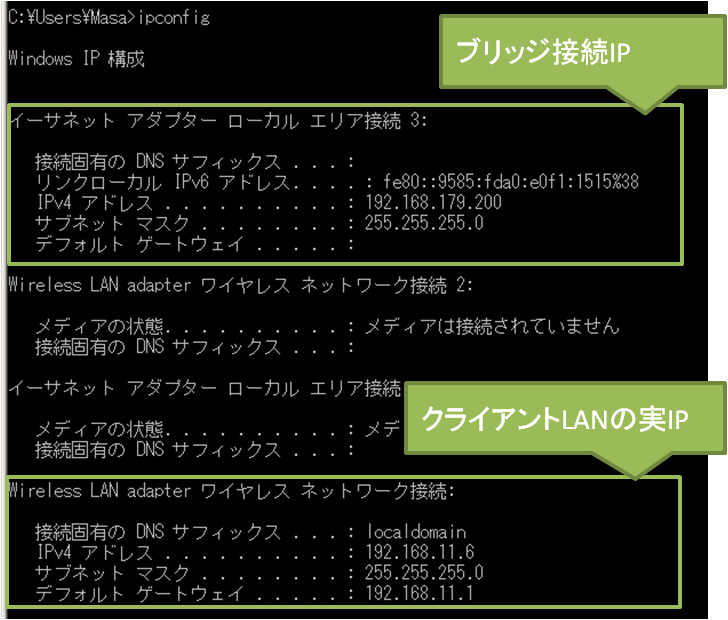
- でも、ping は通らない。
- メモ
  - `ifconfig`
    ```
    br0       Link encap:イーサネット  ハードウェアアドレス 1a:40:17:cf:5c:7b  
          inetアドレス:192.168.179.7  ブロードキャスト:192.168.179.255  マスク:255.255.255.0
          inet6アドレス: fe80::1840:17ff:fecf:5c7b/64 範囲:リンク
          UP BROADCAST RUNNING MULTICAST  MTU:1500  メトリック:1
          RXパケット:43 エラー:0 損失:0 オーバラン:0 フレーム:0
          TXパケット:60 エラー:0 損失:0 オーバラン:0 キャリア:0
          衝突(Collisions):0 TXキュー長:0 
          RXバイト:4996 (4.9 KB)  TXバイト:7153 (7.1 KB)

    eth2      Link encap:イーサネット  ハードウェアアドレス a4:12:42:3b:fa:99  
          inet6アドレス: fe80::a612:42ff:fe3b:fa99/64 範囲:リンク
          UP BROADCAST RUNNING PROMISC MULTICAST  MTU:1500  メトリック:1
          RXパケット:3467 エラー:0 損失:0 オーバラン:0 フレーム:0
          TXパケット:3402 エラー:0 損失:0 オーバラン:0 キャリア:0
          衝突(Collisions):0 TXキュー長:1000 
          RXバイト:1311438 (1.3 MB)  TXバイト:1005234 (1.0 MB)

    lo        Link encap:ローカルループバック  
          inetアドレス:127.0.0.1  マスク:255.0.0.0
          inet6アドレス: ::1/128 範囲:ホスト
          UP LOOPBACK RUNNING  MTU:65536  メトリック:1
          RXパケット:5908145 エラー:0 損失:0 オーバラン:0 フレーム:0
          TXパケット:5908145 エラー:0 損失:0 オーバラン:0 キャリア:0
          衝突(Collisions):0 TXキュー長:0 
          RXバイト:4805898242 (4.8 GB)  TXバイト:4805898242 (4.8 GB)

    tap0      Link encap:イーサネット  ハードウェアアドレス 1a:40:17:cf:5c:7b  
          UP BROADCAST PROMISC MULTICAST  MTU:1500  メトリック:1
          RXパケット:0 エラー:0 損失:0 オーバラン:0 フレーム:0
          TXパケット:0 エラー:0 損失:0 オーバラン:0 キャリア:0
          衝突(Collisions):0 TXキュー長:100 
          RXバイト:0 (0.0 B)  TXバイト:0 (0.0 B)

    wlan0     Link encap:イーサネット  ハードウェアアドレス 5c:c5:d4:1c:f5:70  
          inet6アドレス: fe80::5ec5:d4ff:fe1c:f570/64 範囲:リンク
          UP BROADCAST PROMISC MULTICAST  MTU:1500  メトリック:1
          RXパケット:7639696 エラー:0 損失:0 オーバラン:0 フレーム:0
          TXパケット:8188470 エラー:0 損失:0 オーバラン:0 キャリア:0
          衝突(Collisions):0 TXキュー長:1000 
          RXバイト:5784367971 (5.7 GB)  TXバイト:8292467773 (8.2 GB)

    ```
  - `brctl show`
  ```
  bridge name	bridge id         STP enabled	interfaces
  br0           8000.1a4017cf5c7b	  no        eth2
                                                tap0
  ```
